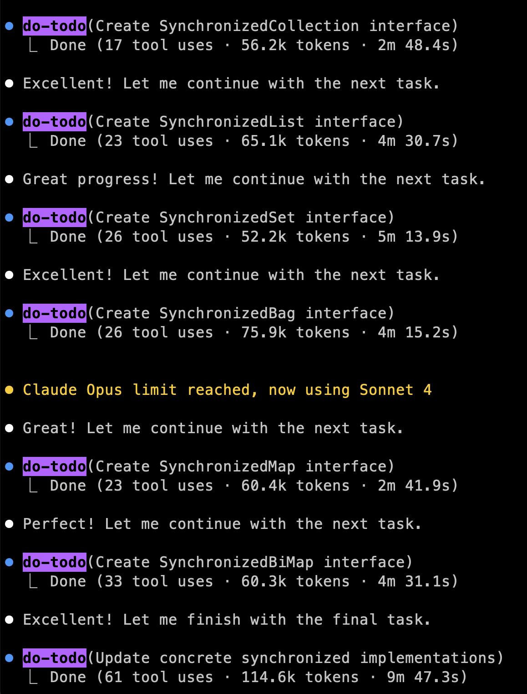
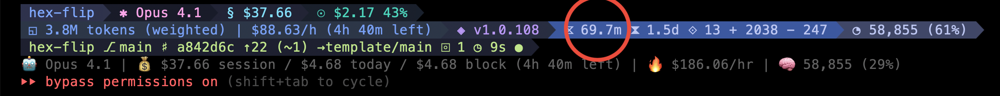
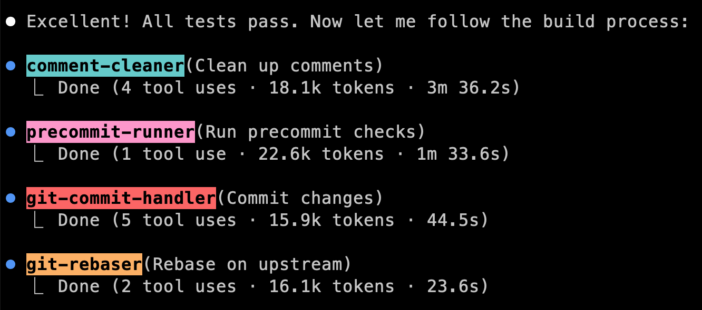
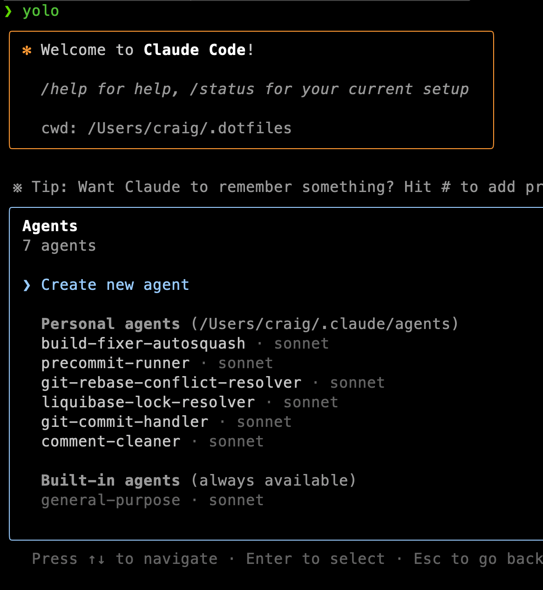
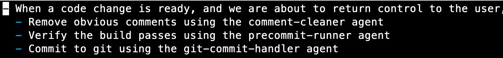
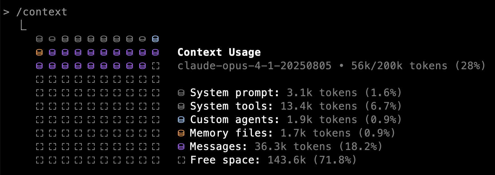
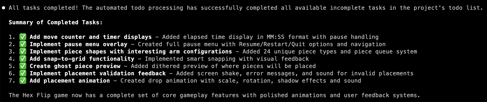

# `/agents`
## Claude Code Subagents

Craig Motlin
September 11, 2025

<!--
Hello, I'm Craig Motlin, today I'll be talking about Claude Code, especially a new feature called subagents.
-->

---

# Agenda

- How I'm using subagents and what works well.
- What are subagents good for?
- How subagents compare with other features.
- How to set up your own subagents.

<!--
Claude Code's subagents, which were released in late July 2025 - just over a month ago - and are an extremely powerful feature of Claude Code. Even though lots of people are using Claude Code, I've asked around, and I know that relatively few of our colleagues are using this feature.

I'll jump right into how I'm using subagents with real examples, then explain what makes them so good, and then I'll compare subagents with other existing features and show why subagents work a little better. After comparing with other tools I'll also show how to set up your own subagents.

My primary goal is to get you using subagents effectively. Since I'm still discovering new use cases myself, I'd love to hear about your experiences - please share what you learn with me or post in Slack so we can all benefit.
-->

---

# Why Me?

- **Role**: IC in DPE, Tech Lead of Multirepo Project
- **AI Interest**: Developer productivity in the ecosystem
- **Claude Code User**: Since developer preview
- **Heavy Usage**: Anthropic changed usage caps for users like me
- **Sharing Knowledge**:
  - Blog: [motlin.com/blog/tags/claude-code](https://motlin.com/blog/tags/claude-code)
  - Config: [github.com/motlin/claude-code-prompts](https://github.com/motlin/claude-code-prompts)

<!--
So why am I (Craig) talking to you about Claude code today?

AI isn't part of my day-to-day role in DPE, but I've been using Claude Code since the developer preview for personal projects.

I'm not an expert, but I do use Claude Code a lot. I'm on the $200/month max plan, and I believe I'm one of the heavy users that prompted Anthropic to change how they calculate usage caps. One of the people that tries to get Claude Code to run 24/7.

I'm just a user who's found some patterns that work well. I write about Claude Code on my blog and share my configuration on GitHub. My configuration at work is the same as on my personal device. All of the code examples I show you today are available in that second link.
-->

---

# Example: My Todo Workflow

I keep a markdown todo list in `.llm/todo.md`:
```markdown
- [ ] Add user authentication
- [ ] Fix navigation bug
- [ ] Update dependencies
```

One command processes my entire list:
```bash
/todo-all
```

<!--
I start with a slash command - `/todo-all`. This is a custom command I created that tells Claude to launch the `@do-todo` subagent repeatedly until all tasks are complete.

The slash command itself mentions the subagents - it says "launch the `@do-todo` subagent" and that subagent's instructions mention the other four subagents (`comment-cleaner`, `precommit-runner`, `git-commit-handler`, `git-rebaser`). This kicks off an elaborate agentic workflow where subagents are calling subagents.

So it starts simple - one slash command - but that launches a whole cascade of subagent activity. Claude keeps working through everything autonomously while I can focus on other things.
-->

---

# Agent Hierarchy

```
/todo-all → launch the @do-todo agent... Repeat until no incomplete tasks
└── @do-todo → Implement the task... then do these things in order:
    ├── Remove obvious comments using the @comment-cleaner agent
    ├── Verify the build passes using the @precommit-runner agent
    ├── Commit to git using the @git-commit-handler agent
    └── Rebase on upstream with the @git-rebaser agent
        └── invoke the @git-rebase-conflict-resolver agent to handle merge conflicts
            └── If more conflicts arise, repeat the @git-rebase-conflict-resolver agent
```

Agents calling agents calling agents!

<!--
Let me walk through this agent hierarchy. The `/todo-all` slash command launches the `do-todo` agent repeatedly. Each time `do-todo` runs, it picks up the next incomplete task from my todo list and implements it.

Toward the end of the `do-todo` agent's prompt, it's instructed to call four other agents in sequence: `comment-cleaner` to remove redundant comments, `precommit-runner` to verify the build passes, `git-commit-handler` to create the commit, and `git-rebaser` to rebase on upstream.

That last one, the `git-rebaser` subagent, similarly can call another subagent. It's prompt says that if during the rebase it encounters merge conflicts, it should invoke the `git-rebase-conflict-resolver` subagent. And that prompt says if more conflicts arise, call itself again recursively.

So we have agents calling agents calling agents - a deep chain of automation. Each subagent has a focused job written into its prompt, and the prompts explicitly tell agents when to delegate to other agents.
-->

---

# do-todo Agent in Action

<div style="text-align: center;">



</div>

<!--
This is the console output from one run of `/todo-all`. What you're seeing at the top level is the repeated invocations of just the `do-todo` subagent - it ran multiple times, once for each task in my todo list.

The nested subagents (`comment-cleaner`, `precommit-runner`, `git-commit-handler`, `git-rebaser`) did run for each task, but their console output is collapsed by default in this view. You can see the hierarchy but not the detailed output from each subagent.

Look at the timestamps - each task took between 2 to 10 minutes. This is just a snippet of the output; it continued on for a long time. The `do-todo` subagent kept picking up tasks, implementing them, running the four cleanup subagents, and moving to the next task. All automatically, without me having to prompt for each one.
-->

---

# Claude Working Autonomously



<!--
This is a screenshot of my Claude Code statusline. Configuring a statusline is a topic for another day, but I have all sorts of information displayed here - token usage, costs, model being used, and session metrics.

The number circled in red is the key - that's the number of minutes that Claude Code has been running since the last time it stopped for human interaction. This chain of todo tasks kept going for about 70 minutes without needing any input from me.

This is the game we play these days: we try to get Claude Code to run for as long as possible without human interaction, within the constraints of the 200,000 token context window. Agents are a key tool for achieving these long autonomous runs - they keep the main context clean while Claude works through complex multi-step tasks.
-->

---

# Agent Chain Execution



<!--
Shows the sequential execution of `comment-cleaner`, `precommit-runner`, `git-commit-handler`, and `git-rebaser` subagents. Perfect example of subagent chaining in practice.
-->

---

# What Are Subagents?

- Anthropic's docs: "specialized AI subagents for task-specific workflows"
- Sounds like they're for... everything?
- Documentation is intentionally general
- Hard to know when to actually use them
- Let me show you what I've found works

<!--
When I first read about subagents, the documentation was so general that it wasn't clear what to use them for. "Task-specific workflows" could mean anything. The docs make it sound like agents are for everything, which isn't very helpful when you're trying to figure out if you should use them. Through trial and error, I've found specific patterns where they really shine.
-->

---

# What Are Subagents Good For?

## 1. Context Management
- **Problem**: Simple commands → Huge console output → Context pollution
- **Solution**: Separate context windows for each agent
- **Result**: Work longer without compacting

## 2. Working Independently
- Claude Code works for longer durations
- Less frequent human involvement needed
- Parallel task execution

**Example**: Test runner output stays in agent's context, not main window

<!--
Claude Code's subagents are good for two main things: First, context management - they help you avoid context pollution and work longer without needing to compact your conversation. Second, they enable Claude Code to work more independently for longer durations before it requires human involvement again.

The main advantage is context management. Especially the test runner - it's a simple command but the console output is huge. That would all wind up in the context. With agents, I can work a lot longer without compacting. When you compact, sometimes you can continue, sometimes Claude gets really disoriented.
-->

---

# Agents vs. Alternatives

Agents share features with existing tools but combine their benefits:

| Feature | Slash Commands | Task Tool | MCP Tools | Agents |
|---------|---------------|-----------|-----------|--------|
| Simple trigger | ✅ | ❌ | ✅ | ✅ |
| Isolated context | ❌ | ✅ | ❌ | ✅ |
| Persistent prompts | ✅ | ❌ | ❌ | ✅ |
| Auto-trigger | ❌ | ❌ | ✅ | ✅ |
| Model switching | ❌ | ❌ | ❌ | ✅ |

<!--
Agents combine the best features of all existing tools. They have simple triggers like slash commands, isolated context like the Task tool, can auto-trigger like MCP tools, and uniquely allow model switching to use cheaper models for simple tasks.
-->

---

# Context Isolation Comparison

## Slash Commands
- ❌ Run in main context window
- ❌ Command prompt loads into conversation
- ❌ Output (test failures, logs) pollutes context

## Task Tool
- ✅ Isolated context window
- ❌ No persistent detailed prompts
- ❌ Brief prompt appears in both contexts

## Agents
- ✅ Isolated context window
- ✅ Detailed prompts stay in agent context
- ✅ Main context only sees agent name/description

<!--
The key advantage of agents over slash commands is context isolation. When I use `/commit` with a slash command, the entire prompt loads into my conversation and any output like test failures consumes my main context. With agents, that massive test output never touches my main context - it stays isolated in the agent's window.
-->

---

# Model Switching Advantages

## The Problem
- Main work needs Opus for complex reasoning
- Side tasks are mechanical and repetitive
- Everything uses the same expensive model

## The Agent Solution
- Main thread: Opus for feature development
- Agents: Sonnet for mechanical tasks
- Benefits:
  - 💰 Cost savings on personal projects
  - 📊 Stay under usage caps
  - ⚡ Faster execution for simple tasks

**"They're all grunt work, mechanical side quests"**

<!--
With slash commands and the Task tool, everything runs on the same model you're using for main work. Agents let me use Opus for complex feature development but run repetitive tasks on Sonnet. This saves money on personal projects and helps stay under usage caps. Plus, Sonnet is actually faster for these simple mechanical tasks.
-->

---

# Automatic Triggering

## How Agents Recognize Tasks

- **Description field**: Acts as the trigger condition
- Added to Claude's main context
- Claude matches tasks to descriptions
- Can also be invoked explicitly

## Examples
```yaml
description: "Run tests and checks before returning control"
description: "Create proper git commits"
description: "Removes redundant comments before commit"
```

When Claude sees it's about to return control after code changes, it automatically runs the appropriate agents.

<!--
The agent's description field is crucial - it's added to Claude's main context and serves as the trigger for when to run the agent. This is how Claude can automatically recognize when to use agents without being explicitly asked. But you can always invoke them explicitly too.
-->

---

# Introduction

- Anthropic's docs are vague: "specialized AI subagents for task-specific workflows"
- I wanted to understand what they were for
- After trial and error, found good use cases
- Still scratching the surface - powerful tool

<!--
I scheduled this meeting to talk about agents. The docs were so vague that I didn't understand what they were for. After playing around with them, I have a good use case, but I still feel like I'm scratching the surface. If you have different use cases, please share.
-->

---

# Anthropic's Documentation

## Example agents:
- Code reviewer: "You are a senior code reviewer"
- Debugger: "You are an expert debugger"
- Data scientist: "You are a data scientist"

## The personification pattern
- Never understood why we personify AI
- Didn't see why you'd need sub-agents for these

<!--
They have examples like code reviewer, debugger, data scientist. They use this pattern where they say "you are a senior code reviewer". I never understood this - we personify AI too much. Even with personas, I didn't understand why you would set up a sub-agent for code review or debugging.
-->

---

# My Use Case: Side Quests

## What I always do after coding:
1. Clean up comments LLMs leave
2. Run pre-commit checks/tests
3. Commit the changes

## The experiment:
"What if I create three agents and ask Claude to always run them at the end?"

**Result: It works pretty well!**

<!--
After trial and error, what worked for me was using agents for side quests. No matter what I'm doing, I always wind up: cleaning up comments, running pre-commit checks, and committing. So I experimented - what if I create three agents and ask Claude to always run them? It works pretty well.
-->

---

# My Three Agents

```bash
❯ cat ~/.claude/agents/{comment-cleaner.md,precommit-runner.md,git-commit-handler.md}
```

1. **comment-cleaner** - Removes redundant comments
2. **precommit-runner** - Runs tests and checks
3. **git-commit-handler** - Creates proper commits

<!--
Let me show you the three agents I use all the time. These are in my ~/.claude/agents directory.
-->

---

# Agent File Structure

```markdown
---
name: your-agent-name
description: When this agent should be invoked
tools: tool1, tool2, tool3  # Optional
---

Your agent's system prompt goes here.
Include specific instructions and constraints.
```

---

# Agent File Locations

| Type | Location | Scope |
|------|----------|-------|
| **Project** | `.claude/agents/` | Current project only |
| **User** | `~/.claude/agents/` | All projects |

Project agents take precedence over user agents

---

# Example: Comment Cleaner Agent

```markdown
---
name: comment-cleaner
description: Removes redundant comments before commit
tools: Read, Edit, Glob
---

You are a code cleanup specialist.
Remove:
- Commented-out code
- Obvious comments
- Past-tense change descriptions
Preserve:
- TODOs
- Important documentation
```

<!--
This is one of my three agents. No matter what I'm doing at the end of building a new feature or fixing some bug, I always wind up cleaning up a bunch of extra stuff, like comments that the LLMs leave.

The comment cleaner agent has instructions to clean up irrelevant comments. In the demo, the agent didn't have any changes to commit because there were no unnecessary comments.
-->

---

# Example: Pre-commit Runner Agent

```markdown
---
name: precommit-runner
description: Run tests and checks before returning control
tools: Bash, Read
---

You verify code quality before completion.
1. Run linting checks
2. Execute test suite
3. Fix any issues found
4. Report results
```

---

# Example: Git Commit Handler

```markdown
---
name: git-commit-handler
description: Create proper git commits
tools: Bash, Read, Grep
---

You handle git commits professionally.
1. Stage appropriate files
2. Create descriptive commit messages
3. Follow repository conventions
4. Never use git add -A
```

---

# My CLAUDE.md Instructions

```markdown
When code changes are ready and we're about to
return control to the user, do these in order:

1. Remove obvious comments using @comment-cleaner agent
2. Verify build passes using @precommit-runner agent
3. Commit to git using @git-commit-handler agent
```

Often runs automatically, or I can say:
**"Please run the three agents"**

<!--
I have this in my `CLAUDE.md` file. When I first wrote this, I didn't know if it would work. But it works really well in practice. Often when building a new feature, it just goes ahead and runs these three subagents at the end. But if it doesn't, I can ask it to "please run the three subagents" and it runs them.
-->

---

# Agents Combine Many Features

1. **Context management** - Separate context window
2. **Persistent prompts** - Don't repeat instructions
3. **Automatic triggering** - Based on description
4. **Model switching** - Use Sonnet for simple tasks
5. **Tool restrictions** - Limit what each agent can do

These used to require separate features (tasks, prompts, etc.)

<!--
When subagents were new, I knew that Anthropic built the feature for a reason that wasn't obvious, so I dug in until I found a way to be productive with them. I found that they are more powerful than previous features (like slash commands and MCP) for context management, and that if you use them effectively you can get Claude Code to work independently for longer durations before it requires human involvement again.

Agents combine a bunch of features that are useful. The task tool was a precursor - you could run things in parallel with separate context. But agents add persistent prompts, triggering, model switching, and tool restrictions all in one package.
-->

---

# Best Practices for Agents

- 🎯 **Single responsibility**: One clear purpose per agent
- 📝 **Detailed prompts**: More guidance = better performance
- 🔧 **Limit tools**: Only grant necessary tools
- 🔄 **Version control**: Check project agents into git
- 🚀 **Start with Claude**: Generate initial agent, then customize

---

# Three Key Benefits in Practice

## 1. 🎯 Longer Sessions
- Clean context = work longer without hitting limits
- No need to compact conversation mid-task
- Test output, build logs stay isolated

## 2. 🔀 Better Task Decomposition
- LLMs perform better with focused prompts
- Agents naturally decompose complex tasks
- Example: git-rebaser → conflict-resolver chain

## 3. 💰 Cost Savings
- Opus for complex reasoning ($$$)
- Sonnet for mechanical tasks ($)
- Stay under usage caps on personal projects

<!--
After using agents for a few weeks, here are the concrete benefits I've found. First, longer sessions - by offloading repetitive tasks to agents, my main context stays clean and I can work much longer without hitting context limits. Second, better task decomposition - since agents can call other agents, they naturally break complex tasks into manageable pieces. Third, cost savings - running simpler tasks on Sonnet instead of Opus saves money and helps stay under usage caps.
-->

---

# Advanced: Agent Chaining

You can chain multiple agents:

```
> First use the code-analyzer agent to find issues,
  then use the optimizer agent to fix them
```

Agents can work sequentially on complex workflows

---

# My Model Configuration

## Main thread: Opus
- Complex reasoning
- Main feature work

## All agents: Sonnet
- Simple, mechanical tasks
- Cheaper and faster
- Helps with usage caps on personal computer

"They're all grunt work, mechanical side quests"

<!--
I have all my agents configured to use Sonnet. I use Opus in the main thread and these side quest things all use Sonnet. They're simple tasks - cleaning comments, running tests. Sonnet is advantageous if cost matters or you're on a subscription. Also faster. On my personal computer, extremely useful for staying under usage caps.
-->

---

# Live Demo

```bash
"Please run the three agents"
```

Claude responds:
"I'll run the three agents in order as specified in your instructions"

1. First agent: comment-cleaner (found no changes)
2. Second agent: precommit-runner (runs tests)
3. Third agent: git-commit-handler (nothing to commit)

<!--
In the demo, I asked Claude to run the three agents. First agent was comment cleaner - it didn't have any changes. Second was precommit-runner - it ran tests. Third was git-commit-handler - there was nothing to commit since we hadn't made changes.
-->

---

# Creating Agents: Two Approaches

## 1. Interactive Creation with `/agents`
- Type `/agents` in Claude Code
- Opens interactive interface
- Claude generates initial agent from description
- Edit and customize the generated agent

## 2. Converting Existing Slash Commands
- Have custom slash commands? Convert them!
- Paste command markdown into agent prompt
- Claude adapts it to agent format
- Edit frontmatter for brevity (saves context)

**Anthropic recommends**: "Start with Claude-generated agents, then iterate"

<!--
The easiest way to create subagents is with the `/agents` command. But if you already have custom slash commands, you can convert them easily. I turned several of my slash commands into subagents by pasting their markdown into the subagent prompts. Claude generated initial subagents from my command descriptions, then I edited the frontmatter for brevity to save context space.
-->

---

# How Agents Run

## Two Ways to Invoke Agents

### 1. 🤖 Automatically
- Claude recognizes task matches agent description
- Happens naturally during workflow
- Example: "about to return control" → runs agents

### 2. 💬 Explicitly
- Direct request: "Run the comment-cleaner agent"
- Batch request: "Run the three agents"
- Force specific agent when needed

## Permission Model
- Same as regular tool use
- Configure tools to run without permission
- See colorful agent names in interface

<!--
Subagents can run automatically when Claude recognizes a task matches a subagent's description, or you can explicitly ask for specific subagents. When they run, you'll see colorful names in the Claude interface, and they ask for permission just like regular tool use - unless you've configured those tools to run without permission.
-->

---

# Tips & Tricks

- 🔧 Use `/agents` command for easy management
- 📁 Store common agents in `~/.claude/agents/`
- 🎨 Generate with Claude, then customize
- 🔄 Share agents with your team via git
- ⚡ Use Sonnet for simple repetitive tasks

---

# Other Agents I've Created

- **build-fixer-autosquash** - Fixes builds and cleans up commits
- **git-rebase-conflict-resolver** - Handles rebase conflicts

Available at:
[github.com/motlin/claude-code-prompts](https://github.com/motlin/claude-code-prompts)

<!--
I have other subagents too. `build-fixer-autosquash` fixes broken builds and cleans up commit history. `git-rebase-conflict-resolver` handles merge conflicts during rebasing. They're all on my GitHub.
-->

---

# Questions?

"I feel like I'm just scratching the surface, so please try them out. My files are up on GitHub so you can copy mine exactly if you like them, or create your own. If you do, please share - I'm super interested in other use cases."

<!--
I really do feel like I'm just scratching the surface with agents. They're a powerful tool. Please try them out and share your use cases with me!
-->

---

# Thank You!

Happy coding with Claude! 🎉

---

# Screenshot: Agents Menu



**TODO**: Determine placement - possibly after "Agent File Locations" slide

<!--
Shows the Claude Code agents menu with personal and built-in agents listed. Demonstrates the interface for accessing agents via the /agents command.
-->

---

# Screenshot: CLAUDE.md Instructions



**TODO**: Determine placement - possibly after "My CLAUDE.md Instructions" slide

<!--
Shows the actual CLAUDE.md instructions for agent workflow: comment-cleaner, precommit-runner, and git-commit-handler in sequence.
-->

---

# Screenshot: do-todo Agent Execution


**TODO**: Determine placement - possibly in new section about automated task processing

<!--
Shows the do-todo agent working through multiple tasks automatically, creating synchronized collection interfaces. Demonstrates agent autonomy and task completion.
-->

---

# Screenshot: Agent Chain Execution


**TODO**: Determine placement - possibly after "Advanced: Agent Chaining" slide

<!--
Shows the sequential execution of `comment-cleaner`, `precommit-runner`, `git-commit-handler`, and `git-rebaser` subagents. Perfect example of subagent chaining in practice.
-->

---

# Screenshot: Context Usage Display



**TODO**: Determine placement - possibly after "Key Benefit: Context Management" slide

<!--
Shows Claude Code's context usage breakdown - system prompt, tools, agents, messages, and free space. Illustrates context management benefits.
-->

---

# Screenshot: Todo Completion Summary



**TODO**: Determine placement - possibly in new section about do-todo agent

<!--
Shows the summary of completed tasks by the do-todo agent for a Hex Flip game project. Demonstrates agent capability to complete complex multi-step tasks.
-->

---

# Screenshot: Statusline Cost Tracking


**TODO**: Determine placement - possibly after "My Model Configuration" slide or in separate statusline presentation

<!--
Shows the Claude Code statusline with cost tracking, token usage, and session metrics. May belong in the statusline presentation instead of agents.
-->
